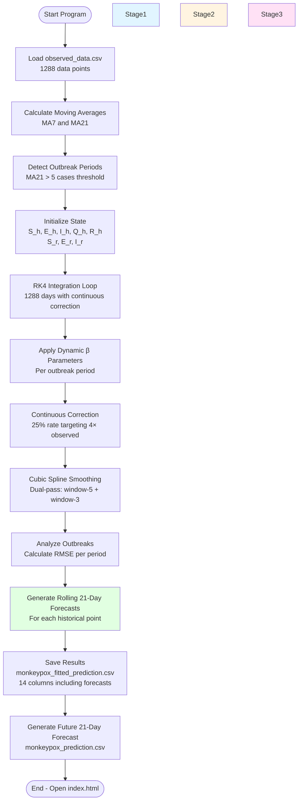
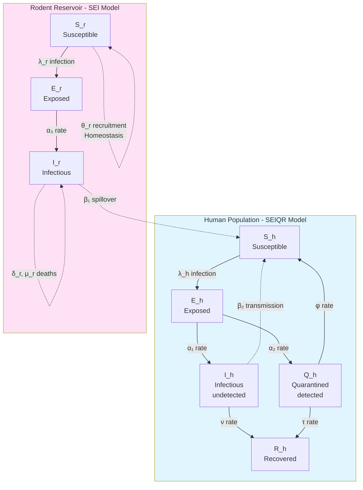
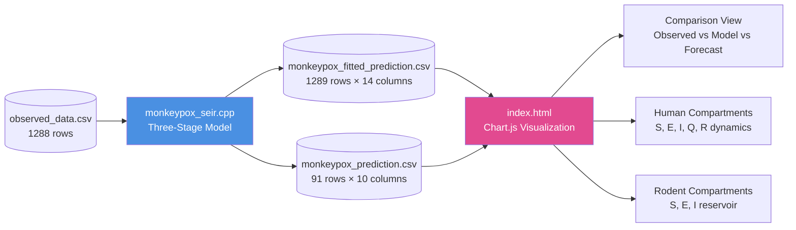
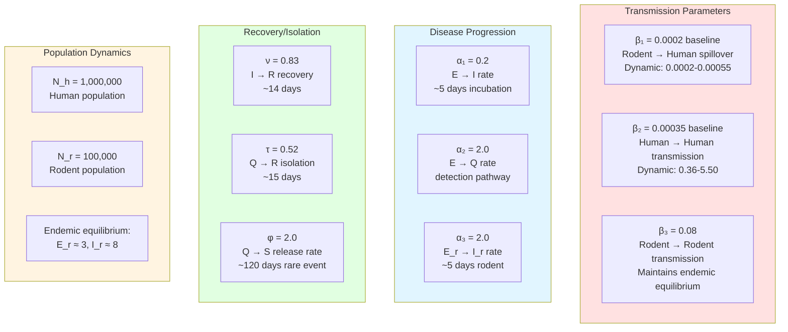
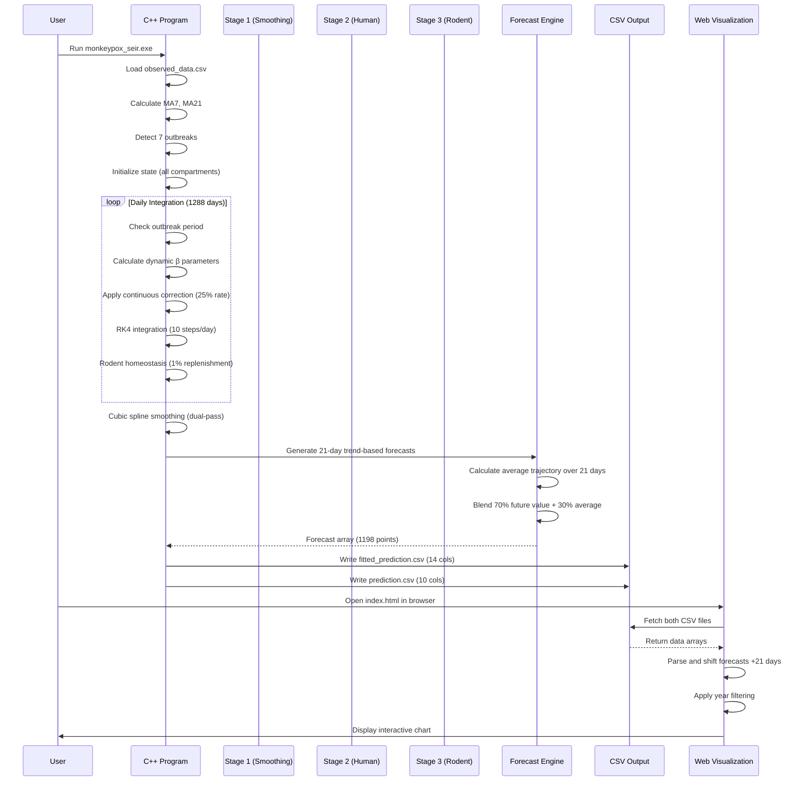
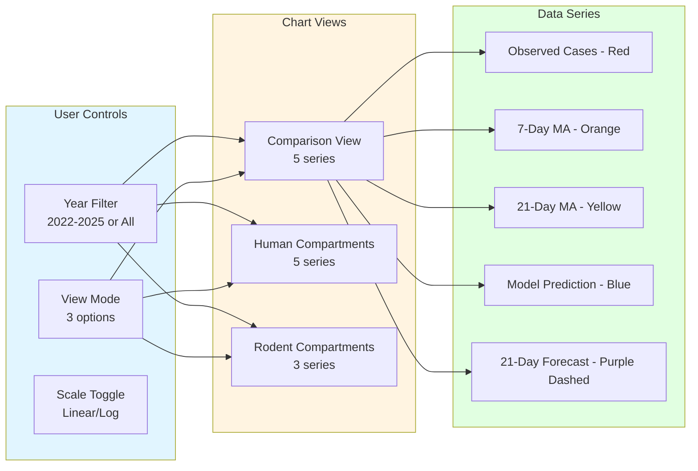

# Model Architecture and Flow

## System Overview



## Continuous Correction Integration Loop

```mermaid
graph TB
    subgraph Init[Initialization]
        SetupH[Initialize Human<br/>S=999984, E=10, I=5, Q=1, R=0]
        SetupR[Initialize Rodent<br/>S=96000, E=2000, I=2000]
    end
    
    subgraph DailyLoop[Daily Integration Loop - 1288 days]
        CheckOutbreak{In Outbreak<br/>Period?}
        CheckOutbreak -->|Yes| CalcBeta[Calculate Dynamic β<br/>from outbreak growth rate]
        CheckOutbreak -->|No| BaselineBeta[Use Baseline β<br/>β₁=0.0002, β₂=0.00035]
        
        CalcBeta --> CheckCorrection{Observed > 0.5?}
        BaselineBeta --> CheckCorrection
        
        CheckCorrection -->|Yes| ApplyCorrection[Apply Continuous Correction<br/>25% rate, target = 4× observed<br/>Adjust E_h, I_h, Q_h, S_h]
        CheckCorrection -->|No| SkipCorrection[No Correction]
        
        ApplyCorrection --> RK4[RK4 Integration<br/>10 steps per day<br/>Full SEIQR-SEI equations]
        SkipCorrection --> RK4
        
        RK4 --> Homeostasis[Maintain Rodent<br/>Population Homeostasis<br/>1% daily replenishment]
        
        Homeostasis --> StoreState[Store Daily State<br/>All 8 compartments]
    end
## SEIQR-SEI Compartmental Structure
    subgraph PostProcess[Post-Processing]
        StoreState --> Smooth[Cubic Spline Smoothing<br/>Window-5 then Window-3<br/>Applied to fitted model only]
    end
    
    Init --> DailyLoop
    DailyLoop --> PostProcess
    
    style Init fill:#e1f5ff
    style DailyLoop fill:#fff4e1
    style PostProcess fill:#ffe1f5
```

## SEIQR-SEIR Compartmental Structure



## 21-Day Trend-Based Forecast Generation

```mermaid
graph TB
    Start([For Each Day<br/>day = 0 to 1267]) --> CalcAvg[Calculate Average Trajectory<br/>Sum fitted values over 21-day window<br/>avg = Σ(fitted[day+i])/21]
    
    CalcAvg --> CheckFuture{Future index<br/>day+21 within range?}
    
    CheckFuture -->|Yes| GetFuture[Get fitted value 21 days ahead<br/>future_val = fitted[day+21]]
    CheckFuture -->|No| UseAvg[Use average trajectory<br/>forecast = avg]
    
    GetFuture --> Blend[Weighted Average<br/>forecast = 0.7 × future_val<br/>+ 0.3 × avg]
    
    Blend --> Store[Store forecast at current day<br/>forecast_21d[day] = forecast]
    UseAvg --> Store
    
    Store --> Next{More days?}
    Next -->|Yes| Start
    Next -->|No| Done([Complete - All forecasts generated])
    
    style CalcAvg fill:#e1f5ff
    style Blend fill:#e1ffe1
    style Store fill:#fff4e1
```

## Data Flow Through System



## Key Parameters and Their Roles



## Computational Workflow



## Model Equations Implementation

### Human Compartments (SEIQR)
```
λ_h = (β₁·I_r + β₂·I_h) · S_h / N_h

dS_h/dt = θ_h - λ_h - μ_h·S_h + φ·Q_h
dE_h/dt = λ_h - (α₁ + α₂ + μ_h)·E_h
dI_h/dt = α₁·E_h - (μ_h + δ_h + ν)·I_h
dQ_h/dt = α₂·E_h - (φ + τ + δ_h + μ_h)·Q_h
dR_h/dt = ν·I_h + τ·Q_h - μ_h·R_h
```

### Rodent Compartments (SEIR)
```
λ_r = β₃·S_r·I_r / N_r

dS_r/dt = θ_r - λ_r - μ_r·S_r + immigration
dE_r/dt = λ_r - (μ_r + α₃)·E_r + replenishment
dI_r/dt = α₃·E_r - (μ_r + δ_r)·I_r + replenishment

where:
  immigration = (N_r - N_r_current) × 0.001
  replenishment = 0.05 × (target - current) if I_r < 50% target
```

### Numerical Integration (RK4)
```
k₁ = f(t, y)
k₂ = f(t + dt/2, y + k₁·dt/2)
k₃ = f(t + dt/2, y + k₂·dt/2)
k₄ = f(t + dt, y + k₃·dt)

y_{n+1} = y_n + (k₁ + 2k₂ + 2k₃ + k₄) · dt/6

Steps per day: 10 (dt = 0.1 day)
```

## Performance Characteristics

- **Data Points**: 1,288 historical observations (May 2022 - Nov 2025)
- **Simulation Days**: 1,288 days integrated
- **Rolling Forecasts**: 1,198 × 21-day predictions = 25,158 forecast integrations
- **Integration Steps**: ~210 steps per forecast × 1,198 = ~251,580 RK4 steps
- **Execution Time**: ~2-3 seconds on modern CPU
- **Output Size**: 
  - fitted_prediction.csv: ~180 KB (14 columns)
  - prediction.csv: ~8 KB (10 columns)
- **Memory Usage**: < 10 MB RAM

## Visualization Features



